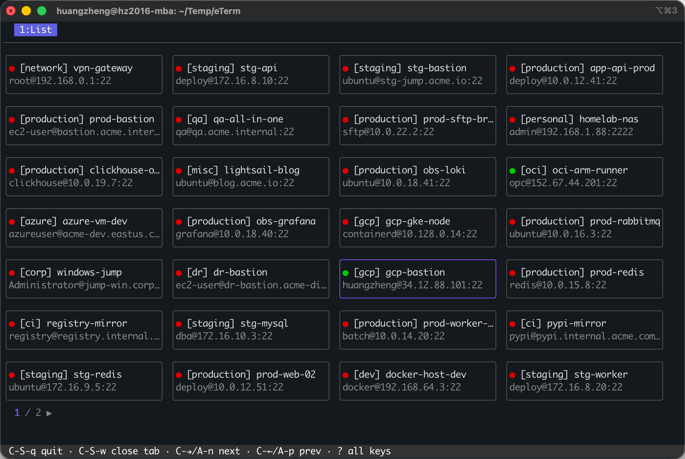
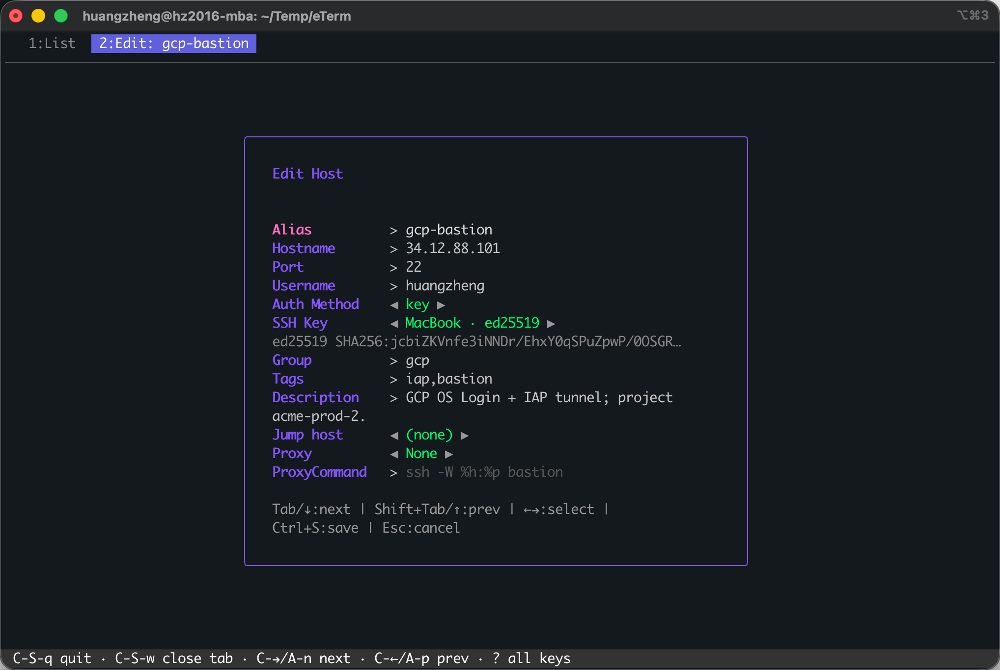
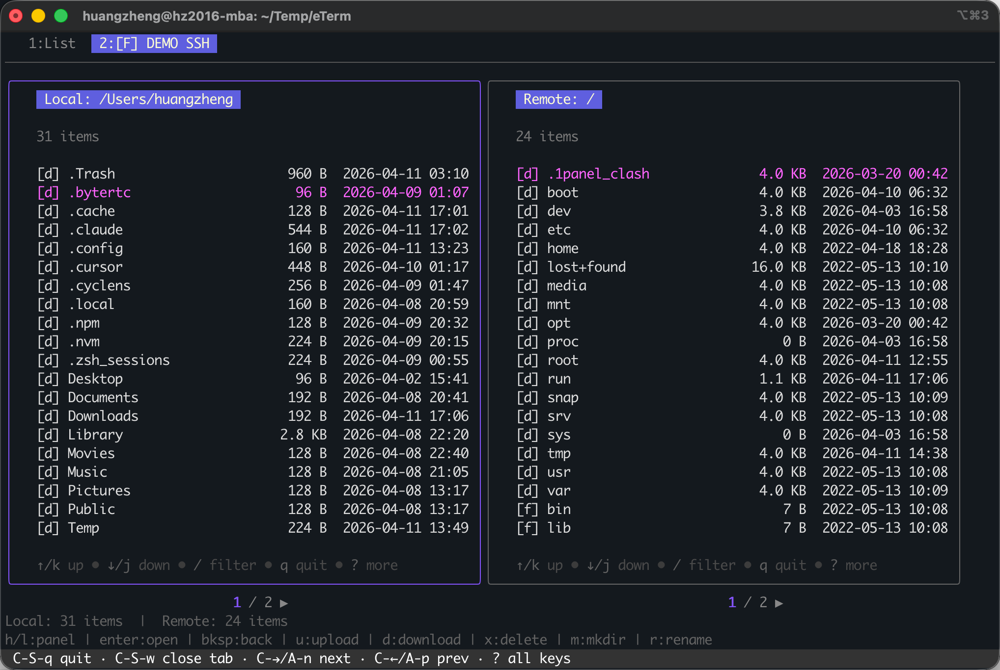
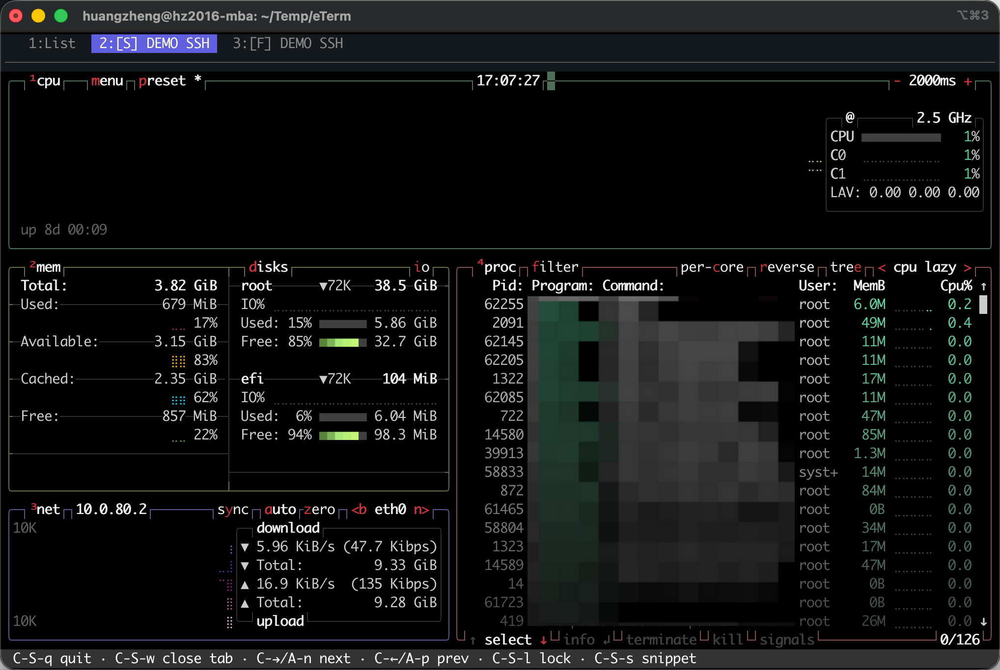

# eTerm

基于 [Bubble Tea](https://github.com/charmbracelet/bubbletea) 与 [Lip Gloss](https://github.com/charmbracelet/lipgloss) 的现代终端 SSH 客户端。

## 功能

- **SSH / LocalShell** -- 多标签终端、滚动回看、断线提示与重连
- **主机与密钥管理** -- 主机分组、标签、搜索，内置 SSH 密钥库
- **导入** -- 支持导入 `~/.ssh/config` 与 Termius 主机数据
- **SFTP 与端口转发** -- 双栏文件管理，本地/远程/动态端口转发
- **同步与远程 Shell** -- 通过 syncd 在多台设备间同步配置，并打开同租户设备上的远程 Shell
- **效率工具** -- 命令片段、会话记录、剪贴板链接粘贴、命令面板、可配置快捷键
- **安全存储** -- 主密码加密敏感字段；同步数据传输前加密，服务端只保存密文

## 演示

| 主机列表 | 主机编辑 |
|:---:|:---:|
|  |  |

| SFTP 文件管理 | SSH 终端 |
|:---:|:---:|
|  |  |

## 安装

从 [Releases](https://github.com/huangzheng2016/eTerm/releases) 下载与 CI 一致的压缩包，或一键安装（需已安装 `curl`，Windows 可选 Git Bash 或下方 PowerShell）：

**Linux / macOS / Windows (Git Bash)**

```bash
curl -fsSL https://raw.githubusercontent.com/huangzheng2016/eTerm/master/scripts/install.sh | sh
```

默认安装到 `~/.local/bin/eterm`（Windows 为 `~/bin/eterm.exe`）。可设置环境变量 `INSTALL_DIR` 指定目录。

**Windows (PowerShell)**

```powershell
iwr -useb https://raw.githubusercontent.com/huangzheng2016/eTerm/master/scripts/install.ps1 | iex
```

**从源码构建**

```bash
go build -o eterm .
./eterm
```

同步服务端（可选）：

```bash
go build -o etermsyncd ./cmd/etermsyncd
GOOS=linux GOARCH=amd64 CGO_ENABLED=0 go build -o etermsyncd-linux ./cmd/etermsyncd
```

## 快速开始

```bash
# TUI 模式
./eterm

# 直连（不存在则自动创建主机）
./eterm root@192.168.1.1
./eterm deploy@prod.example.com -p 2222
```

## 命令行参数


| 参数                  | 说明                             |
| ------------------- | ------------------------------ |
| `-c path`           | SQLite 数据库路径                   |
| `-p port`           | 与直连主机一起使用时指定端口                 |
| `-v`                | 打印版本并退出                        |
| `--version-json`    | 以 JSON 打印 version / commit 并退出 |
| `--no-update-check` | 禁用解锁后的 GitHub 版本检查             |


## 快捷键

在非 SSH 标签页按 `?` 查看完整快捷键（与设置中的改键一致）。常用：


| 按键              | 功能                 |
| --------------- | ------------------ |
| `Enter`         | SSH 连接             |
| `n` / `e` / `d` | 新建 / 编辑 / 删除       |
| `s`             | SFTP               |
| `c`             | 复制 SSH 命令          |
| `C`             | 克隆主机               |
| `h` / `H`       | 隐藏主机 / 切换隐藏可见      |
| `/`             | 搜索                 |
| `Esc`           | 打开菜单（退出 / 设置 / 同步） |
| `C-S-i`         | 上传剪贴板文件/图片并粘贴链接   |
| `C-Tab`         | 下一标签页              |
| `C-k`           | 命令面板               |
| `?`             | 所有快捷键              |


导入 `~/.ssh/config` 时若存在重名主机，可选择跳过或覆盖。

快捷键显示使用短写：`C` = Ctrl，`S` = Shift，`A` = Alt，例如 `C-S-i` 表示 `Ctrl+Shift+I`。

## 多设备同步

`Esc` -> Sync 打开同步设置。默认使用 HTTP syncd；远程 Shell 和剪贴板托管也依赖 HTTP syncd。

最小启动：

```bash
etermsyncd -listen :8443 -db ./sync.db -api-key <token>
```

生产环境通常让 syncd 监听本机端口，由反向代理负责 HTTPS：

```bash
sudo install -m 0755 etermsyncd-linux /usr/local/bin/etermsyncd
sudo install -d -m 0755 /etc/etermsyncd /var/lib/etermsyncd
printf 'ETERMSYNCD_API_KEY=%s\n' '<token>' | sudo tee /etc/etermsyncd/etermsyncd.env
sudo chmod 600 /etc/etermsyncd/etermsyncd.env
```

`/etc/systemd/system/etermsyncd.service`：

```ini
[Unit]
Description=eTerm sync daemon
After=network-online.target
Wants=network-online.target

[Service]
Type=simple
EnvironmentFile=/etc/etermsyncd/etermsyncd.env
ExecStart=/usr/local/bin/etermsyncd -listen 127.0.0.1:8080 -db /var/lib/etermsyncd/sync.db
Restart=always
RestartSec=3
User=root

[Install]
WantedBy=multi-user.target
```

```bash
sudo systemctl daemon-reload
sudo systemctl enable --now etermsyncd
```

需要远程 Shell 时，在可访问的 eTerm 主机上启动 daemon：

```bash
eterm daemon start
eterm daemon status
eterm daemon stop
```

同步设置里仍可选择 SSH 模式做一次性同步，但远程 Shell 和剪贴板文件托管只支持 HTTP 模式。同步数据在上传前加密，syncd 不保存明文。

## 剪贴板链接粘贴

在 `[L]` 本地 Shell、`[S]` SSH Shell、`[R]` 远程 Shell 中可使用：

- 普通粘贴：本地 Shell 和本地 tmux 中，剪贴板里的本地文件会粘贴为 `[filename](file:///path)`；SSH 和远程 Shell 会上传到 HTTP syncd 后粘贴链接
- `C-S-i`：强制读取系统剪贴板文件/图片，上传到 HTTP syncd，向当前 Shell 粘贴 `[filename](url)`
- `C-k` -> `Paste URL`：同样强制上传，适合作为兜底入口

短链格式为 `https://sync.example.com/b/<token>`，有效期 30 分钟。文件/图片最大 10 MiB。上传功能只支持 HTTP syncd。

普通文本粘贴不受影响。纯图片剪贴板通常不会触发终端文本粘贴事件，请使用 `C-S-i` 或命令面板入口上传。

## 推荐 tmux 配置

本地 tmux 和远端 tmux 都推荐启用 OSC52 剪贴板。远端 tmux 需要这样配置，复制内容才能通过 eTerm 同步回本地系统剪贴板。

`~/.tmux.conf`：

```tmux
# 启用鼠标支持：滚轮滚动历史、拖动选择复制
set -g mouse on

# 复制模式使用 vi 按键
set -g mode-keys vi

# 通过 OSC52 同步到外层终端剪贴板
set -g set-clipboard on
set -as terminal-features ',*:clipboard'

# 鼠标拖动选择后自动复制到系统剪贴板
bind -T copy-mode-vi MouseDragEnd1Pane send -X copy-selection-and-cancel
bind -T copy-mode MouseDragEnd1Pane send -X copy-selection-and-cancel

# 在 copy mode 中按 y 复制到系统剪贴板
bind -T copy-mode-vi y send -X copy-selection-and-cancel
bind -T copy-mode y send -X copy-selection-and-cancel

# 开启扩展键支持，使 Ctrl+Enter / Shift+Enter 等组合键正常工作
set -g extended-keys on
set -g extended-keys-format csi-u
```

重载配置：

```bash
tmux source-file ~/.tmux.conf
```

## 数据

默认路径：`~/.config/eterm/eterm.db`（SQLite），可用 `-c path` 指定。

敏感字段（密码、私钥）由主密码派生密钥加密。首次运行完成加密初始化，支持无密码模式。设置页可修改主密码。

偏好项在设置标签页中修改，`C-s` 保存。

tmux 恢复记录保存到 `~/.config/eterm/tmux_restore.json`，仅用于下次启动询问是否恢复本地/远端 tmux 标签页，不参与同步。

## 调试


| 变量                      | 作用                        |
| ----------------------- | ------------------------- |
| `ETERM_DEBUG_KEYS`      | 向 stderr 输出按键事件           |
| `ETERM_DEBUG_APP`       | 向 stderr 输出 SSH/SFTP 连接日志 |
| `ETERM_PPROF_ADDR`      | 开启主进程 pprof，例如 `127.0.0.1:6060` |
| `ETERM_DAEMON_PPROF_ADDR` | 开启 daemon pprof，例如 `127.0.0.1:6061` |
| `ETERMSYNCD_PPROF_ADDR` | 开启 syncd pprof，例如 `127.0.0.1:6062` |
| `ETERM_NO_UPDATE_CHECK` | 禁用 GitHub 版本检查            |

pprof 默认关闭，也可以用显式参数开启：

```bash
eterm -pprof 127.0.0.1:6060
eterm daemon start -pprof 127.0.0.1:6061
etermsyncd -pprof 127.0.0.1:6062 ...
```

卡住时抓现场：

```bash
curl -o goroutine.txt 'http://127.0.0.1:6060/debug/pprof/goroutine?debug=2'
go tool pprof 'http://127.0.0.1:6060/debug/pprof/profile?seconds=30'
curl -o trace.out 'http://127.0.0.1:6060/debug/pprof/trace?seconds=5'
```


## 许可

[MIT](LICENSE)
